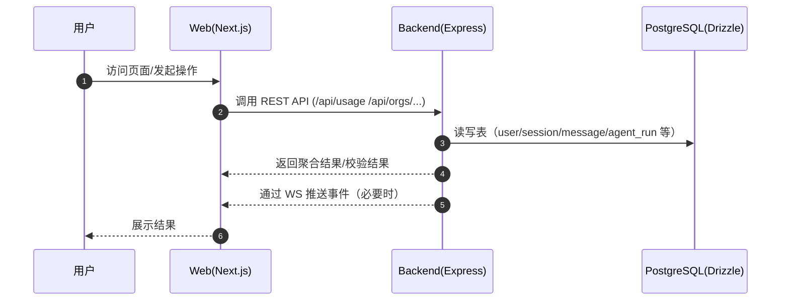

# Codebuff 项目技术文档（面向新手开发者）

> 本文档基于本仓库源码实际分析编写（最后更新：2025-09）。采用 Monorepo 结构，前端 Next.js 14（App Router）、后端 Express（Bun 运行时）、数据库 PostgreSQL（Drizzle ORM）。

---

## 目录

- [项目概述与功能](#项目概述与功能)
- [技术栈说明](#技术栈说明)
- [项目架构设计](#项目架构设计)
- [目录结构详解](#目录结构详解)
- [安装与运行指南](#安装与运行指南)
- [API 接口文档](#api-接口文档)
- [核心功能模块详解](#核心功能模块详解)
- [数据流程说明](#数据流程说明)
- [配置文件说明](#配置文件说明)
- [开发指南与最佳实践](#开发指南与最佳实践)
- [常见问题与故障排除](#常见问题与故障排除)
- [学习资源](#学习资源)

---

## 项目概述与功能

Codebuff 是一款“多智能体协作”的 AI 编码助手：
- 能在你的代码仓库中进行检索、规划多步修改、实现改动并进行验证。
- 提供 Web 管理端（登录、配额/用量、团队/结算）与独立后端 API（鉴权、组织/仓库覆盖检查、用量查询）。
- 支持在你的应用中集成的 TypeScript SDK（packages/sdk）。

核心价值：以多智能体（Planner、Implementation、Reviewer 等）组合流程，提升对复杂代码库的理解与修改的准确率。

---

## 技术栈说明

- 运行与包管理
  - Monorepo（workspaces）：`common/`, `backend/`, `web/`, `packages/*`, `sdk/`, `scripts/`, `evals/`
  - 主要使用 Bun（>=1.2.11）运行脚本与依赖安装；Node 版本要求 >= 20
- 前端（web）
  - Next.js 14（App Router）、React 18、TypeScript
  - UI：TailwindCSS、shadcn/ui、Radix UI
  - 内容：MDX、contentlayer
  - 测试：Jest、Playwright
- 后端（backend）
  - 运行时：Bun；框架：Express + WebSocket
  - 日志：pino；跨域：cors
  - 外部 AI 提供方：OpenAI、Anthropic、Gemini、OpenRouter（以 provider 适配）
- 通用与数据库（common）
  - Drizzle ORM（PostgreSQL），数据库脚本与迁移在 `common/src/db`
  - 认证：next-auth（web 侧）与 session 表（common/schema）
  - 支付/计费：Stripe（packages/billing）
- 环境变量与配置（packages/internal/src/env.ts）
  - 使用 `@t3-oss/env-nextjs` 和 Zod 严格校验 Server/Client 变量

---

## 项目架构设计

```mermaid
flowchart LR
  subgraph Client[Web 前端 (Next.js)]
    UI[UI/Pages/Components]
    Hooks[Hooks & Lib]
  end

  subgraph Backend[后端 (Express on Bun)]
    API1[/REST: /api/usage/]
    API2[/REST: /api/orgs/is-repo-covered/]
    API3[/REST: /api/agents/validate-name/]
    WS[WebSocket /ws]
  end

  subgraph Common[Common & Packages]
    DB[(PostgreSQL via Drizzle)]
    Billing[packages/billing]
    Internal[packages/internal\nenv & providers]
  end

  Client -->|HTTP/WS| Backend
  Backend -->|Drizzle ORM| DB
  Backend --> Billing
  Backend --> Internal
  Client --> DB -.->|通过 API 间接访问| Backend
```

要点：
- Web 前端仅通过后端 API 与数据库交互（不直接访问 DB）。
- 后端集中处理鉴权、组织/仓库覆盖查询、用量聚合与 WebSocket 推送等。
- `common` 统一维护 DB Schema、工具方法与跨包类型。

---

## 目录结构详解

根目录关键文件/目录：
- `package.json`：workspace 与顶层脚本（如 `scripts/dev.sh`、`start-server`、`start-web`）
- `local-development.md`：本地开发详细指南（direnv、Infisical、Bun、Docker）
- `backend/`：后端服务（Express + WS），入口 `src/index.ts`
- `web/`：Next.js 前端应用
- `common/`：通用库与 DB（Drizzle schema、迁移、工具）
- `packages/`：子包（billing、bigquery、internal、code-map 等）
- `sdk/`：供外部应用接入的 SDK
- `scripts/`：運维/统计脚本（TypeScript）

后端（backend/src）要点：
- `api/usage.ts`：POST /api/usage（用户或组织用量查询）
- `api/org.ts`：POST /api/orgs/is-repo-covered（仓库是否被组织覆盖）
- `api/agents.ts`：GET /api/agents/validate-name（智能体名称校验）
- `websockets/`：WS 连接、鉴权、客户端切换（优雅下线）
- `templates/`、`llm-apis/`、`tools/`：智能体模板、AI provider 适配与工具

通用与数据库（common/src）：
- `db/schema.ts`：核心表定义（user、session、message、org、org_member、credit_ledger、agent_run/agent_step 等）
- `db/docker-compose.yml`：本地 Postgres 服务
- `tools/`、`util/`、`types/`：通用工具、类型与常量

前端（web/src）：
- `app/`：Next App Router 路由（登录、定价、组织、邀请、文档等）
- `components/`：UI 组件（navbar、providers、credits 等）
- `lib/`：会话、权限、Stripe、日志等工具
- `content/`：文档内容（MDX）

---

## 安装与运行指南

先决条件：
- Bun >= 1.2.11（推荐）
- Node >= 20（部分工具/类型检查）
- Docker（本地数据库）
- direnv + Infisical（可选，便于加载机密与环境变量）

步骤：
1) 安装依赖

```bash
bun install
```

2) 启动数据库（将自动生成/迁移 Schema）

```bash
bun run start-db        # 等价于: bun --cwd common db:start
```

3) 启动后端服务（默认读取 env.PORT）

```bash
bun run start-server    # 等价于: bun --cwd backend dev
```

4) 启动前端（默认 3000 端口，支持 NEXT_PUBLIC_WEB_PORT）

```bash
bun run start-web       # 会先起 DB，再 next dev
```

5) 可选：启动 Web 的 Discord Bot 脚本（见 web/package.json）

环境变量（示例，部分择要）：
- 服务端：`PORT`, `DATABASE_URL`, `OPEN_AI_KEY`, `ANTHROPIC_API_KEY`, `GEMINI_API_KEY`, `OPEN_ROUTER_API_KEY`, `STRIPE_SECRET_KEY` 等
- 客户端：`NEXT_PUBLIC_CB_ENVIRONMENT`, `NEXT_PUBLIC_CODEBUFF_APP_URL`, `NEXT_PUBLIC_CODEBUFF_BACKEND_URL`, `NEXT_PUBLIC_STRIPE_PUBLISHABLE_KEY` 等
- 完整校验参见 `packages/internal/src/env.ts`

---

## API 接口文档

所有接口基于 Express，JSON 交互。基础健康检查：`GET /healthz -> ok`

1) 校验智能体名称
- 方法与路径：`GET /api/agents/validate-name?agentId=xxx`
- 认证：需要 `x-codebuff-api-key` 头
- 请求参数：`agentId`（Query，必填）
- 响应：
```json
{ "valid": true, "source": "builtin|published", "normalizedId": "...", "displayName": "..." }
```
- 异常：`403 { valid:false, message:"API key required" }`；`400`（参数错误）

2) 仓库是否被组织覆盖
- 方法与路径：`POST /api/orgs/is-repo-covered`
- 认证：需要 `x-codebuff-api-key`（用于解析 userId）
- 请求体：`{ "owner": string, "repo": string, "remoteUrl": string }`
- 响应：
```json
{ "isCovered": boolean, "organizationName": "string|undefined", "organizationId": "string|undefined", "organizationSlug": "string|undefined" }
```

3) 用量查询（个人/组织）
- 方法与路径：`POST /api/usage`
- 认证：`fingerprintId` 必填；`authToken`（可选，如提供将解析 userId）；`orgId`（可选，查询组织用量）
- 请求体：`{ "fingerprintId": string, "authToken"?: string, "orgId"?: string }`
- 响应：组织用量或个人用量的汇总 JSON（内部聚合，字段较多）
- 错误：`401 { message: INVALID_AUTH_TOKEN_MESSAGE }` 或参数错误 `400`

4) 管理端数据重标注（仅管理员，带 CORS）
- `GET/POST /api/admin/relabel-for-user`（需要 `checkAdmin` 中间件与 CORS 预检）

---

## 核心功能模块详解

- 多智能体与模板（backend/src/templates, backend/src/main-prompt.ts 等）
  - 定义可被调用的智能体、提示词与子智能体的编排逻辑。
- LLM Provider 适配（backend/src/llm-apis/*）
  - OpenAI、Anthropic、Gemini、OpenRouter 等统一封装与容错（如 `gemini-with-fallbacks.ts`）。
- WebSocket 通道（backend/src/websockets/*）
  - 路径 `/ws`，用于推送事件、断点续连、优雅停机时通知客户端迁移。
- 计费与组织（packages/billing, common/src/db/schema.ts）
  - 表 `credit_ledger`, `org`, `org_member`, `org_repo`, `org_invite`, `org_feature` 等；Stripe 集成用于订阅与扣费。
- 分析与埋点（@codebuff/common/analytics, packages/bigquery）
  - BigQuery 初始化与事件上报。

---

## 数据流程说明



---

## 组件关系图（前端高层级）

```mermaid
graph TD
  A[app/layout.tsx] --> P[app/page.tsx]
  A --> R[app/(routes...)]
  A --> Providers[components/providers/*]
  P --> Navbar[components/navbar/*]
  P --> Sections[components/*]
  R --> FeaturePages[pricing|profile|orgs|agents|docs|invites]
```

---

## 数据模型（ER 略图）

```mermaid
erDiagram
  USER ||--o{ SESSION : has
  USER ||--o{ ACCOUNT : links
  USER ||--o{ CREDIT_LEDGER : credits
  USER ||--o{ REFERRAL : refers
  ORG ||--o{ ORG_MEMBER : includes
  ORG ||--o{ ORG_REPO : tracks
  ORG ||--o{ ORG_INVITE : invites
  ORG ||--o{ ORG_FEATURE : features
  AGENT_RUN ||--o{ AGENT_STEP : steps

  USER {
    text id PK
    text email
    text stripe_customer_id
    bool auto_topup_enabled
    timestamp created_at
  }
  SESSION {
    text sessionToken PK
    text userId FK
    timestamp expires
    text type
  }
  MESSAGE {
    text id PK
    text user_id FK
    jsonb request
    jsonb response
    int input_tokens
    int output_tokens
  }
  ORG { text id PK, text slug, text owner_id FK }
  AGENT_RUN { text id PK, text user_id FK, text agent_id, text status }
  AGENT_STEP { text id PK, text agent_run_id FK, int step_number }
```

注：实际字段更丰富，详见 `common/src/db/schema.ts`。

---

## 配置文件说明

- 根 `package.json`
  - 重要脚本：`start-db`（拉起 Postgres + 迁移）、`start-server`（后端）、`start-web`（前端）
- `packages/internal/src/env.ts`
  - 使用 Zod 校验所有必需的环境变量，缺失时会给出友好报错
- `common/src/db/drizzle.config.ts` 与 `docker-compose.yml`
  - 本地数据库配置与迁移工具配置
- 前端配置
  - `web/next.config.mjs`, `tailwind.config.ts`, `postcss.config.cjs`, `contentlayer.config.ts`

---

## 开发指南与最佳实践

- 环境与机密
  - 推荐使用 direnv + Infisical 统一管理（参考根目录 `local-development.md`）
- 包管理与运行
  - 本项目以 Bun 为主，统一使用 `bun install` / `bun run <script>`
- 类型与格式
  - `bun run typecheck`，`prettier` + `eslint`，提交前保持通过
- 数据库
  - 本地开发：`bun run start-db` 自动 compose + 生成 + 迁移
  - 调整 Schema 后：在 `common` 下用 `db:generate` / `db:migrate`
- 测试
  - Web：`bun --cwd web test`，E2E：`bun --cwd web e2e`
  - 后端与包：各子包 `bun test`
- 日志与排错
  - 后端使用 `pino`，Web 端有 `util/logger.ts` 简易封装

代码示例（后端入口）：

```ts
// backend/src/index.ts（简化）
app.post('/api/usage', usageHandler)
app.post('/api/orgs/is-repo-covered', isRepoCoveredHandler)
app.get('/api/agents/validate-name', validateAgentNameHandler)
```

---

## 常见问题与故障排除

- 缺少环境变量
  - 现象：启动时报 `Environment variables not loaded...`（来自 `packages/internal/src/env.ts`）
  - 处理：按 `local-development.md` 使用 direnv/Infisical 或在 shell 中导出所需变量
- 本地数据库无法连接
  - 现象：`DATABASE_URL` 无效或 Docker 未启动
  - 处理：确保 Docker 可用；执行 `bun run start-db`；检查连接串
- Bun 版本不兼容
  - 现象：脚本执行异常或依赖解析失败
  - 处理：升级至 Bun >= 1.2.11
- API 403/401
  - 现象：调用 `/api/agents/validate-name` 或 `/api/usage` 报权限错误
  - 处理：携带 `x-codebuff-api-key` 或有效 `authToken`；参考 API 章节

---

## 学习资源

- Next.js: https://nextjs.org/docs
- Bun: https://bun.sh/docs
- Drizzle ORM: https://orm.drizzle.team/docs
- Zod: https://zod.dev
- TailwindCSS: https://tailwindcss.com/docs
- shadcn/ui: https://ui.shadcn.com
- Express: https://expressjs.com
- Stripe: https://stripe.com/docs

---

如需更深入的架构细节或新增模块的文档模板，请在 issue/PR 中提出需求。
